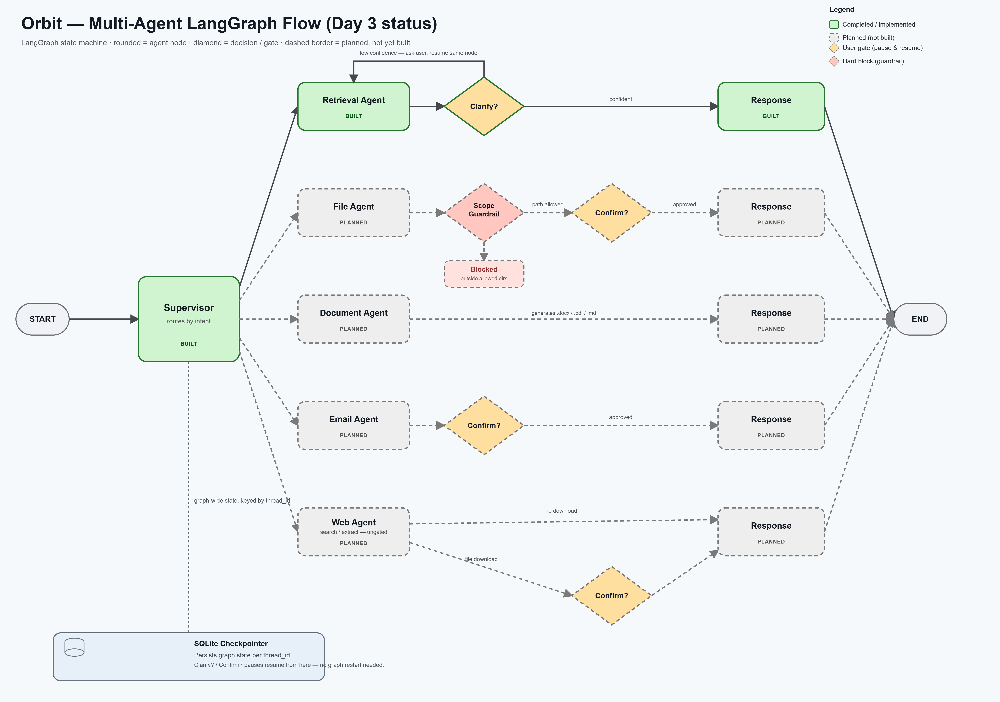

# Orbit

**Orbit** is a local-first, multi-agent personal AI assistant. It runs entirely on your own
machine — local LLM inference via [Ollama](https://ollama.com), local vector search via
[ChromaDB](https://www.trychroma.com) — so your documents and conversations never leave your
device.

The long-term goal is a supervisor-orchestrated set of specialist agents (retrieval, file
management, document generation, email, web search) coordinated through
[LangGraph](https://www.langchain.com/langgraph), with human-in-the-loop confirmation before any
side-effecting action (moving files, sending email, downloading from the web).

> Orbit is under active day-by-day development. This README reflects current progress, not the
> full end-state design.

## Why local-first

- **Privacy** — your files and queries are embedded, indexed, and answered on-device. Nothing is
  sent to a third-party API.
- **Control** — the model, the data, and the retrieval pipeline are all inspectable and
  swappable.
- **Cost** — no per-token API bill for everyday use.

## Architecture at a glance

```
┌─────────────┐      ┌───────────────┐      ┌──────────────────┐
│   FastAPI   │─────▶│  Ollama (LLM) │      │     ChromaDB      │
│  (API layer)│      │  qwen2.5:7b   │      │  (vector store)   │
└─────────────┘      └───────────────┘      └──────────────────┘
       │                                              ▲
       ▼                                              │
┌──────────────────────────────────────────────────────────────┐
│                     Ingestion pipeline                        │
│   load (pdf/docx/md/txt) → chunk → embed → index               │
└──────────────────────────────────────────────────────────────┘
```

Future layers (LangGraph Supervisor + specialist agents + interrupt-based
clarify/confirm gates) are documented in the project's internal implementation plan and will
land incrementally — see [Progress](#progress) below.

### Multi-agent flow



Supervisor routes to specialist agents (Retrieval, File, Document, Email, Web), each behind its
own gate where relevant — Clarify? for low-confidence retrieval, Confirm? before any
side-effecting action, and a hard scope guardrail on the File Agent. A SQLite checkpointer
persists state per conversation thread so a paused gate resumes without restarting the graph.

## Project layout

```
src/orbit/
├── api/routes/       FastAPI route handlers
├── config.py         Settings loaded from .env (pydantic-settings)
├── db/                ChromaDB collection access
├── document_agent/     Document generators (write_markdown/write_docx/write_pdf)
├── email_agent/         SMTP mailer (build_message/send_email)
├── file_agent/         Scope guardrail (allowlist) + move/rename actions
├── generation/        Prompt construction for grounded generation
├── graph/              LangGraph state, checkpointer, nodes, compiled graph
├── ingestion/          Document loaders, chunking, indexing
├── llm/                Ollama client (health check + generation)
├── rag/                Retrieval + generation orchestration (standalone, pre-graph)
├── retrieval/          Top-k retrieval over the vector store
├── web_agent/           DDGS search + trafilatura content extraction
└── main.py            FastAPI app entrypoint

scripts/                Standalone CLI entrypoints (index, query, ask, chat)
tests/                  pytest test suite
```

Standard Python **src-layout**: application code lives under `src/orbit`, kept separate from
tests, scripts, and project metadata. Each package under `src/orbit/` owns a single concern
(ingestion, retrieval, generation, etc.) rather than one monolithic module.

## Getting started

**Prerequisites:** Python 3.11+, [Ollama](https://ollama.com) running locally with a pulled model.

```bash
# 1. Install Ollama and pull the model this project is configured for
ollama pull qwen2.5:7b

# 2. Create a virtual environment and install dependencies
python -m venv .venv
.venv\Scripts\activate          # Windows
pip install -e ".[dev]"

# 3. Configure environment
copy .env.example .env          # then edit if your Ollama host/model differs

# 4. Run the API
uvicorn orbit.main:app --reload
curl http://localhost:8000/health
```

### Index your documents

```bash
python scripts/index_folder.py "path/to/your/folder"
```

Supports `.pdf`, `.docx`, `.md`, `.txt`. Re-running against the same folder upserts rather than
duplicates.

### Query the index directly (bypasses the LLM)

```bash
python scripts/query_index.py "your question" 5
```

Useful for verifying retrieval quality in isolation from generation.

### Ask a grounded question (retrieval + generation)

```bash
python scripts/ask.py "your question"
```

Returns an LLM-generated answer grounded in your indexed documents, along with the source
filenames it drew from.

### Multi-turn chat (LangGraph, with Clarify/Confirm gates)

```bash
python scripts/chat.py
```

Runs the compiled Supervisor graph in a REPL loop, with conversation state persisted
per-session via a SQLite checkpointer. Supervisor routes each message to one of five specialists:

- **Retrieval Agent** — if the best match is too weak to trust, pauses via `interrupt()` with a
  Clarify? question instead of guessing.
- **File Agent** — extracts a move/rename plan from your request, refuses outright if the path
  is outside `ORBIT_ALLOWED_DIRS` (a hard guardrail, checked before anything else), otherwise
  pauses via `interrupt()` with a Confirm? prompt describing the exact action before touching
  disk.
- **Document Agent** — generates a `.md`/`.docx`/`.pdf` grounded in retrieved context at a path
  you specify (e.g. "generate a report summarizing X, save as markdown at ..."). Resolves
  follow-up references ("summarize *that*") against the conversation so far before retrieving.
  The destination is scope-checked like the File Agent, but ungated — no Confirm? step, since
  creating a new file is lower-risk than moving or renaming an existing one.
- **Email Agent** — extracts a recipient/subject/body (and optional attachment) from your
  request, resolving "myself"/"me" against `ORBIT_USER_EMAIL` and matching a referenced document
  against what's indexed (e.g. "email me my resume"). Any attachment is scope-checked, then a
  Confirm? prompt shows the exact recipient/subject/attachment before anything is sent via SMTP.
- **Web Agent** — searches the web (DDGS) and extracts page content (`trafilatura`) to ground its
  answer — read-only, no gate. If you also ask it to save the results (e.g. "...and save as
  pdf"), that destination is scope-checked and Confirm?-gated like the other side-effecting
  actions, and the saved file is auto-indexed into Chroma so it's immediately retrievable.

A Clarify?/Confirm? pause resumes the same graph run (not a restart) via `Command(resume=...)`
on your next input.

### Run tests

```bash
pytest
```

## Progress

| Day | Focus | Status |
|---|---|---|
| 1 | FastAPI skeleton + Ollama health check. Ingestion pipeline: load → chunk → embed → index into ChromaDB. | ✅ Done |
| 2 | Standalone retrieve → prompt → generate loop (`scripts/ask.py`). | ✅ Done |
| 3 | LangGraph Supervisor + Retrieval Agent, SQLite checkpointer, interrupt-based Clarify? gate. | ✅ Done |
| 4 | File Agent (move/rename) with scope guardrail + Confirm? gate. | ✅ Done |
| 5 | Document Agent (generate `.docx`/`.pdf`/`.md`), grounded in retrieval, ungated. | ✅ Done |
| 6 | Email Agent (SMTP, Confirm?-gated) + Web Agent (search/extract ungated, save-and-index Confirm?-gated). | ✅ Done |
| 7 | Multi-turn, multi-agent end-to-end tests; README + architecture diagram refresh; demo prep. | 🚧 In progress |

## Tech stack

- **API:** FastAPI, Uvicorn
- **LLM inference:** Ollama (qwen2.5:7b)
- **Vector store:** ChromaDB (bundled ONNX MiniLM embeddings)
- **Document processing:** LangChain community loaders, LangChain text splitters
- **Document generation:** python-docx, fpdf2
- **Web search & extraction:** ddgs, trafilatura
- **Email:** smtplib (stdlib)
- **Config:** pydantic-settings
- **Orchestration:** LangGraph (Supervisor + 5 specialist agents, SQLite checkpointer)
- **Testing:** pytest

## License

Personal project — no license granted for reuse at this time.
